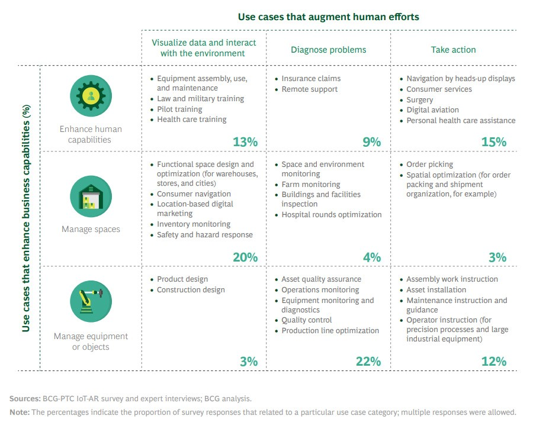

PTC and Boston Consulting Group (BCG) surveyed more than 200 executives from companies using Internet of Things (IoT) and/or augmented reality (AR) solutions.
Fifty percent of survey respondents have currently demonstrated the value of using IoT and AR, while more than eighty percent of the companies surveyed believe the technology will become the standard in their industry within five years.

Connectivity and remote collaboration have become critical during the COVID-19 crisis, when industrial companies must enable offsite and on-site employees to collaborate and maintain business continuity. IoT and AR are viewed as augmenting those efforts.

Case study value propositions / scenarios identified by BCG-PTC included in following [chart](https://iotbusinessnews.com/2020/04/17/59470-eighty-percent-of-executives-managing-iot-and-ar-strategies-expect-the-tech-to-become-industry-standard-within-five-years/).

